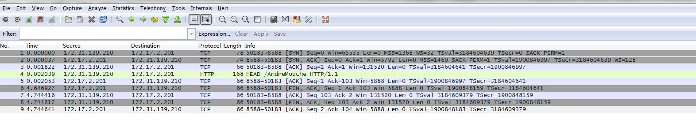

##“use of closed network connection”

http.Client执行do出现“use of closed network connection”,是因为传入的req对象的body已被关闭，

具体为在创建req时，使用了如下方式:

```
http.NewRequest("POST", postUrl, bytes.NewReader([]byte(testData)))
```
即request body以io.Reader的形式传入，该方式创建的req在执行过http.Client的Do方法后，request body会被关闭。
出现该标题错误的一般场景是，在执行Do失败时，直接复用req进行重试。
http.NewRequest函数说明：

```
// NewRequest returns a new Request given a method, URL, and optional body.
//
// If the provided body is also an io.Closer, the returned
// Request.Body is set to body and will be closed by the Client
// methods Do, Post, and PostForm, and Transport.RoundTrip.
func NewRequest(method, urlStr string, body io.Reader) (*Request, error) 
```

解决方法是，在每次执行http.Client的Do方法前，确保req的body是未关闭的reader

## “EOF” vs "connection reset by peer"

高并发下会触发以上两类问题。
###"EOF"

出现EOF归根到底是因为服务端主动关闭了连接。

问题追踪过程：
golang在调用http.Client.Do函数时，会按以下步骤执行：

1. 跟服务端建立TCP连接
2. 向服务端发送请求数据
3. 接收来自服务端的请求头

本次出现EOF是在第二步完成之后，golang底层调用Read fd读数据时返回的数据长度为0且无错误，golang把这种行为判为EOF返回。
这是因为服务端主动关闭了连接后，客户端将读取不到任何数据，从而造成以上错误。

### VS "connection reset by peer"
该错误与另一种错误"connection reset by peer"的区别
1."connection reset by peer"是因为请求量过多，服务端直接拒绝了该请求，客户端会收到一个“RST”的包:


2.“EOF” 是服务端接收了连接，并主动关闭连接，抓包过程中可以看到完整的四次握手，断开连接过程



